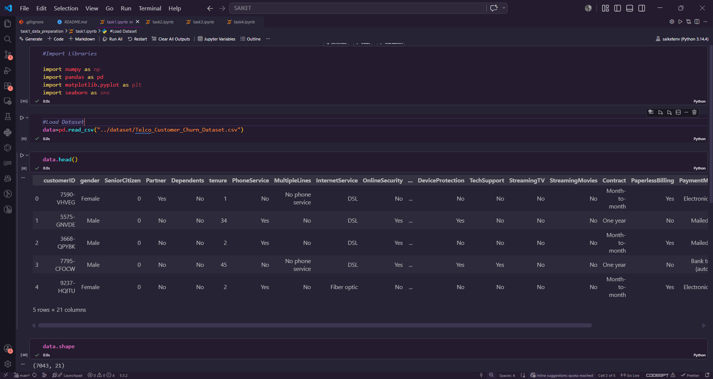
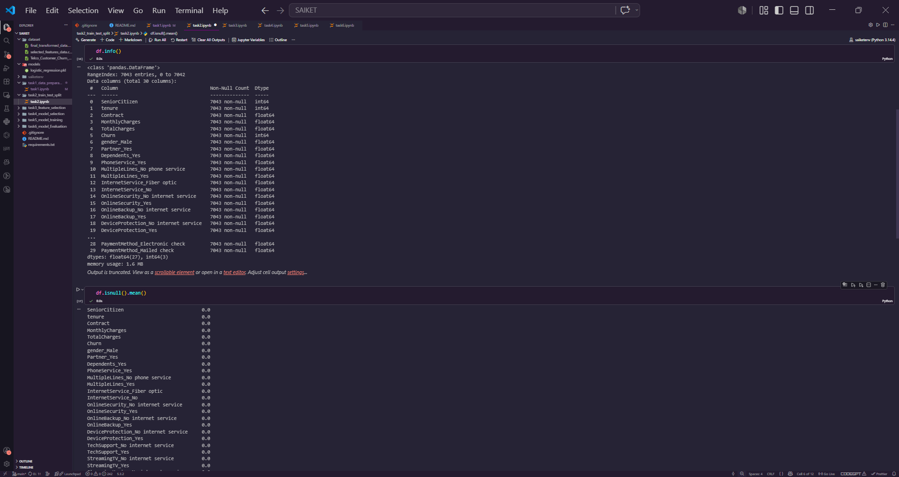
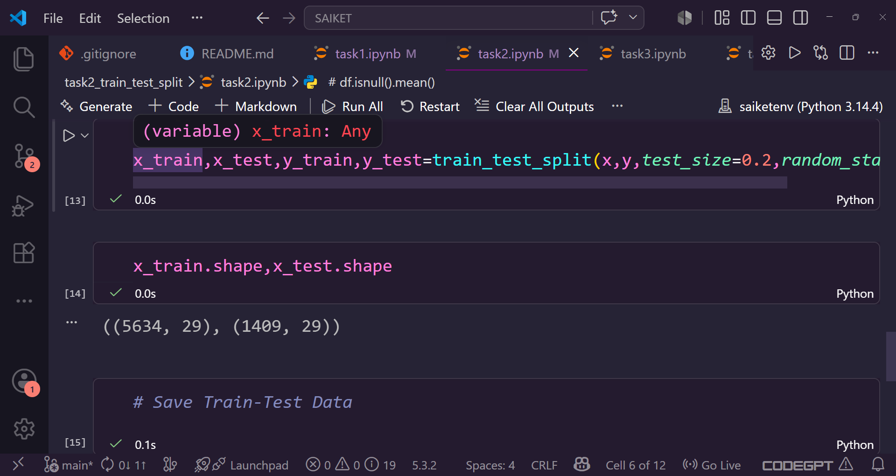
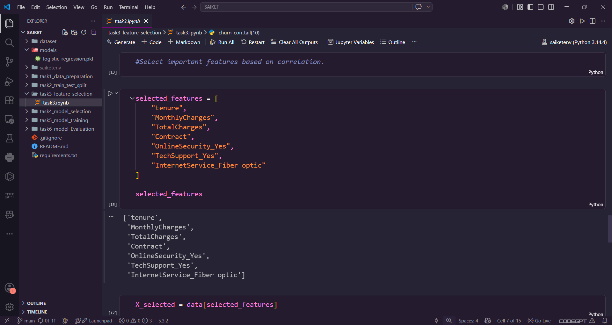
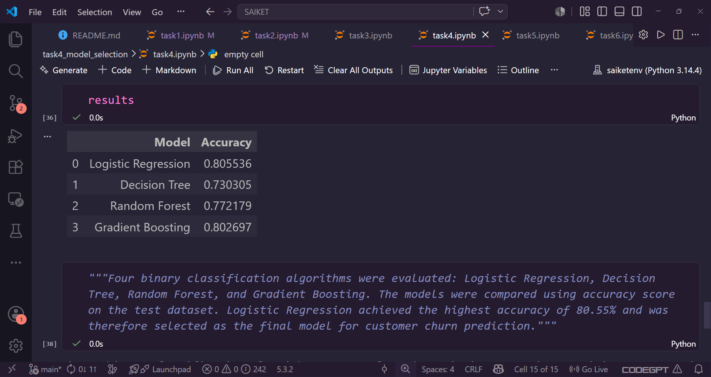
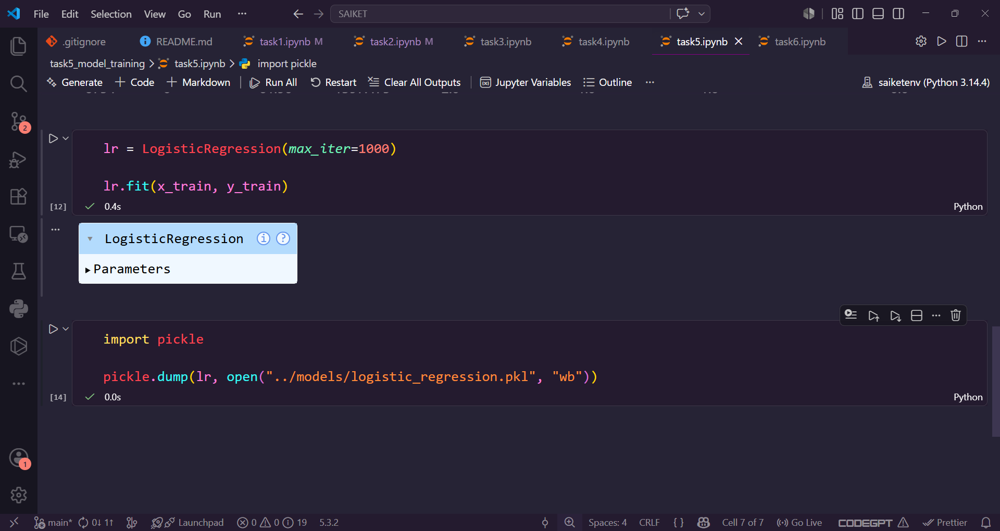
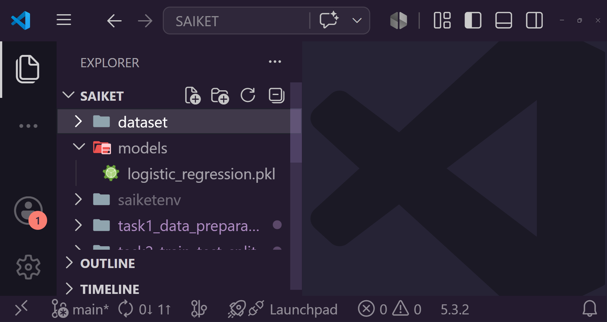
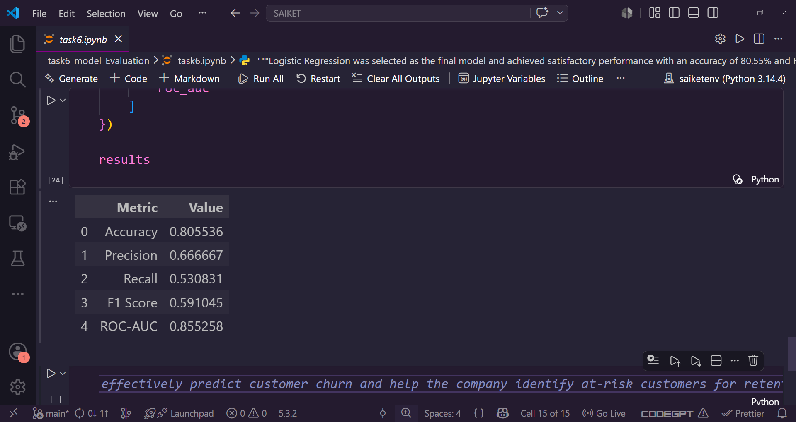

# Customer Churn Analysis and Prediction

## Internship Project

This project was completed as part of my first internship assignment. The objective of the project is to analyze customer churn in a telecommunications company and build a machine learning model that can predict whether a customer is likely to leave the company.

Customer churn is a major challenge for telecom companies because losing existing customers can directly impact revenue and business growth. By identifying customers who are likely to churn, companies can take preventive actions and improve customer retention.

---

## Project Objective

The main objectives of this project are:

* Analyze customer churn data.
* Perform data preprocessing and cleaning.
* Select important features affecting churn.
* Compare multiple machine learning algorithms.
* Train the best-performing model.
* Evaluate the model using various performance metrics.

---

## Dataset Information

The dataset contains customer information such as:

* Gender
* Senior Citizen Status
* Partner
* Dependents
* Tenure
* Phone Service
* Internet Service
* Online Security
* Tech Support
* Contract Type
* Payment Method
* Monthly Charges
* Total Charges
* Churn Status

Target Variable:

**Churn**

* 1 = Customer Churned
* 0 = Customer Retained

---

# Task 1: Data Preparation

### Activities Performed

* Loaded the customer churn dataset using Pandas.
* Explored dataset structure and information.
* Identified missing values.
* Handled missing values in the TotalCharges column.
* Encoded categorical variables using Label Encoding, Ordinal Encoding, and One-Hot Encoding.
* Prepared the dataset for machine learning.

### Skills Applied

* Data Preprocessing
* Missing Value Handling
* Feature Encoding
* Data Cleaning

---

# Task 2: Train-Test Split

### Activities Performed

* Separated features and target variable.
* Split the dataset into training and testing sets.
* Used an 80:20 split ratio.
* Maintained reproducibility using a fixed random state.

### Skills Applied

* Data Splitting
* Machine Learning Workflow Preparation
* Dataset Management

---

# Task 3: Feature Selection

### Activities Performed

Correlation analysis was performed to identify features that strongly influence customer churn.

Selected Features:

* Contract
* tenure
* InternetService_Fiber optic
* TotalCharges
* MonthlyCharges
* OnlineSecurity_Yes
* TechSupport_Yes

### Reason for Selection

These features showed stronger relationships with customer churn and were considered the most informative predictors.

### Skills Applied

* Feature Relevance Analysis
* Correlation Analysis
* Domain Knowledge

---

# Task 4: Model Selection

### Models Evaluated

1. Logistic Regression
2. Decision Tree
3. Random Forest
4. Gradient Boosting

### Model Comparison

| Model               | Accuracy |
| ------------------- | -------- |
| Logistic Regression | 80.55%   |
| Decision Tree       | 73.03%   |
| Random Forest       | 77.22%   |
| Gradient Boosting   | 80.27%   |

### Selected Model

**Logistic Regression**

### Reason for Selection

Logistic Regression achieved the highest accuracy among all tested models and performed well for this binary classification problem.

### Skills Applied

* Binary Classification
* Model Comparison
* Algorithm Selection

---

# Task 5: Model Training

### Activities Performed

* Trained the Logistic Regression model using the selected features.
* Used the training dataset for learning patterns.
* Saved the trained model using Pickle.

Saved Model:

```text
models/logistic_regression.pkl
```

### Skills Applied

* Model Training
* Machine Learning Pipeline
* Model Persistence

---

# Task 6: Model Evaluation

### Evaluation Metrics

| Metric    | Value  |
| --------- | ------ |
| Accuracy  | 80.55% |
| Precision | 66.67% |
| Recall    | 53.08% |
| F1 Score  | 59.10% |
| ROC-AUC   | 85.53% |

### Interpretation

* The model correctly classified approximately 81% of customers.
* Precision indicates that when the model predicts churn, it is correct about 67% of the time.
* Recall shows that the model successfully identified more than half of actual churning customers.
* The ROC-AUC score demonstrates strong ability to distinguish churning customers from non-churning customers.

---

# Technologies Used

* Python
* Pandas
* NumPy
* Matplotlib
* Seaborn
* Scikit-Learn
* Pickle
* Jupyter Notebook

---

# Project Structure

```text
SAIKET/
│
├── dataset/
│   ├── Telco_Customer_Churn_Dataset.csv
│   ├── final_transformed_data.csv
│   └── selected_features_data.csv
│
├── models/
│   └── logistic_regression.pkl
│
├── task1_data_preparation/
│   └── task1.ipynb
│
├── task2_train_test_split/
│   └── task2.ipynb
│
├── task3_feature_selection/
│   └── task3.ipynb
│
├── task4_model_selection/
│   └── task4.ipynb
│
├── task5_model_training/
│   └── task5.ipynb
│
├── task6_model_evaluation/
│   └── task6.ipynb
│
├── README.md
└── requirements.txt
```

---
---

## Project Screenshots

### Dataset Preview


### Data Preparation


### Train-Test Split


### Feature Selection


### Model Comparison


### Model Training


### Saved Model


### Model Evaluation



---

# Conclusion

In this project, customer churn data was analyzed and processed to build a predictive machine learning model. After comparing multiple classification algorithms, Logistic Regression was selected as the best-performing model. The model achieved an accuracy of 80.55% and demonstrated strong performance in identifying customers likely to churn.

This project helped me gain practical experience in data preprocessing, feature selection, machine learning model development, and model evaluation as part of my first internship journey.

---

# Author

Rupesh Prakash Mane

Saiket Syatems Internship Project – Customer Churn Analysis and Prediction
